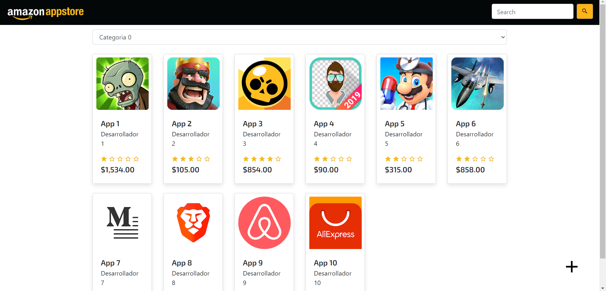

# Amazon app

- Es un clon de una tienda de aplicaciones en línea. 
- Genera de forma aleatoria los datos de cada una de las aplicaciones 
- Utiliza la API de [IndexeDB](https://developer.mozilla.org/en-US/docs/Web/API/IndexedDB_API) para almacenar la data
- Puede agregar y eliminar apps

